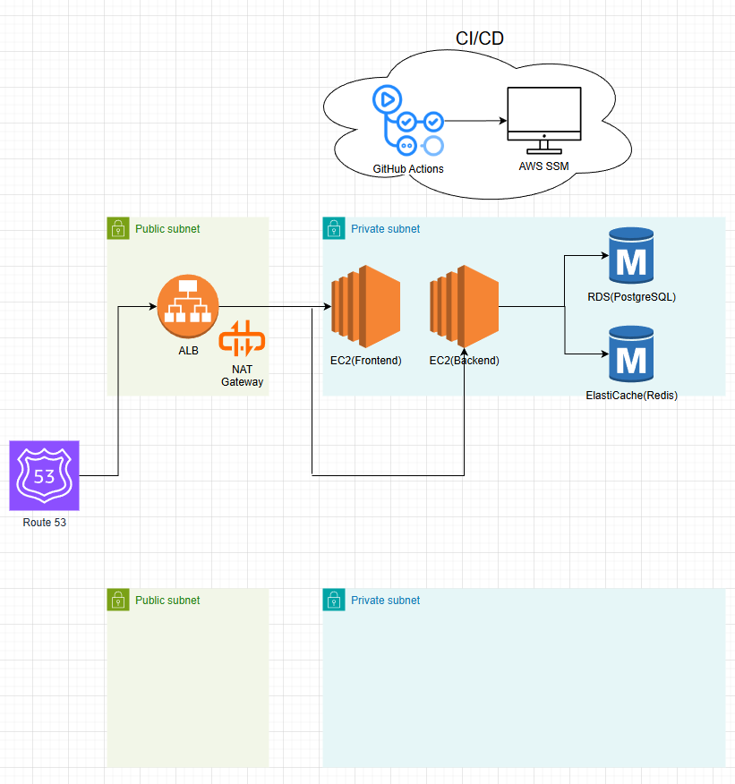

<p align="center">
  
</p>

<h1 align="center">OpenPoll</h1>

<p align="center">
  <b>정치 참여를 쉽고 재미있게</b><br/>
  실시간 투표 · 정치 성향 테스트 · 밸런스 게임 · AI 뉴스 요약
</p>

<p align="center">
  <a href="https://openpoll.co.kr"><s>openpoll.co.kr</s></a> &nbsp;·&nbsp; <i>운영 종료</i>
</p>

<p align="center">
  <sub>
    데브코스 풀스택 8기 팀 프로젝트(6명) &nbsp;·&nbsp;
    원본 팀 저장소: <a href="https://github.com/P2P-J/OpenPoll">P2P-J/OpenPoll</a><br/>
    본 저장소는 <b>본인(박찬영, tmakdrl) 기여를 중심으로 재정리한 사본</b>이며, 아래 기여 표기는 모두 <b>git 커밋 기록 기준</b>입니다.
  </sub>
</p>

---

## 미리보기

> 라이브 서비스는 종료되었지만, 아래는 **실제 운영 화면**입니다.
> 화면(프론트엔드) 구현 및 캡처 수록은 팀원 조보근 님 작업입니다.

| 화면                            | 라이트 모드                                                     | 다크 모드                                                      |
| ------------------------------- | --------------------------------------------------------------- | -------------------------------------------------------------- |
| **홈 · 실시간 지지율 대시보드** |        |        |
| **DOS 정치 성향 테스트 · 결과** |  |  |
| **밸런스 게임 · 찬반 투표**     |     |     |

---

> ## 프로젝트 종료 안내
>
> **OpenPoll 서비스는 2026년 5월을 끝으로 운영을 종료했습니다.**
> 본 저장소는 학습 / 포트폴리오 목적으로 보존됩니다.
>
> |               |                                                                   |
> | ------------- | ----------------------------------------------------------------- |
> | **운영 기간** | 2026-01-24 ~ 2026-05-11 (약 3.5개월)                              |
> | **종료 사유** | AWS 인프라 운영비 부담 (월 약 $200) + Google AdSense 수익화 미승인 |
>
> 라이브 URL `www.openpoll.co.kr` 은 더 이상 응답하지 않습니다.
> 로컬 개발 환경에서는 여전히 풀스택으로 구동 가능합니다 — 하단 [시작하기](#시작하기) 참조.

---

## 한 줄 요약

MZ세대의 정치 참여를 게이미피케이션으로 유도한 풀스택 웹 플랫폼.
회원·투표·SSE 실시간 통계·정치 성향 테스트(DOS)·밸런스 게임·포인트·출석까지 — **데브코스 8기 팀(6명)이 약 3.5개월에 걸쳐 구축**한 정치 콘텐츠 플랫폼입니다.

본인(**박찬영, tmakdrl**)은 **백엔드 초기 설계자**로서 프로젝트 시작 시점에 **모듈 기반 MVC 백엔드 골격과 도메인 모듈 전반을 구축**했고(`create initial backend` — 45개 파일 / 4,386줄), 이후 **인증·투표·DOS·밸런스·포인트·프로필** 도메인의 주 작성자로 참여했습니다. 인프라 쪽에서는 **초기 GitHub Actions CI/CD 파이프라인과 TLS·배포 스크립트**를 세팅했습니다.

주 참여 구간은 **2026-01-28 ~ 2026-03-06** 이며, 전체 235커밋 중 **39커밋**입니다. 이후 4~5월 운영·SEO·서비스 종료 작업은 다른 팀원(조보근)이 담당했습니다.

---

## 프로젝트 정보

| 항목              | 내용                                              |
| ----------------- | ------------------------------------------------- |
| 프로젝트 유형     | 데브코스 풀스택 8기 팀 프로젝트 (6명)             |
| 원본 저장소       | [P2P-J/OpenPoll](https://github.com/P2P-J/OpenPoll) |
| 팀 개발 기간      | 2026-01-24 ~ 2026-04-23                           |
| 운영 기간         | ~ 2026-05-11                                      |
| 팀 전체 커밋 수   | 235 (no-merge 기준)                               |
| **본인 커밋 수**  | **39** (2026-01-28 ~ 2026-03-06, 이후 리팩토링 1회) |
| **본인 담당**     | **백엔드 초기 구축 · 도메인 모듈 · 초기 CI/CD·TLS** |
| 도메인            | https://www.openpoll.co.kr (종료)                 |
| 인프라            | AWS (ap-northeast-2)                              |
| 라이선스          | MIT                                               |

### 팀 구성 / 역할

OpenPoll 은 **데브코스 풀스택 8기의 팀 프로젝트(6명)** 로 진행되었습니다. 아래는 **git 커밋 기록 기준** 팀원별 주 담당이며, 커밋 수는 no-merge 기준입니다.

| 팀원                                             | 커밋 | 주 담당 영역                                                                              |
| ------------------------------------------------ | ---- | ------------------------------------------------------------------------------------------ |
| 조보근 ([@Aen](https://github.com/Aen)) — 최다 기여 | 137  | 프론트엔드 전반, 디자인 시스템·다크모드, 실시간 전체 채팅(SSE), DOS 결과 카드·공유, SEO/AdSense, **4~5월 운영·서비스 종료** |
| **박찬영 (tmakdrl)**                             | 39   | **백엔드 초기 구축 및 도메인 모듈**(인증·투표·DOS·밸런스·포인트·프로필), **초기 CI/CD·TLS·배포 스크립트** |
| 김정철 (KimJeongChul / JeongChul)                | 29   | 뉴스 크롤러 + OpenAI 요약(BullMQ 큐), 배포 워크플로 수정(IAM/EC2·헬스체크 경로)            |
| nicephj95                                        | 16   | 인증 화면, OAuth 콜백 플로우, 밸런스 게임 프론트                                            |
| 김재우 (jaewooKim)                               | 14   | 프론트엔드 (DOS·뉴스·홈 페이지 기여)                                                       |

#### 본인(박찬영)이 담당한 영역 — 커밋으로 확인되는 범위

> 아래 항목은 모두 본 저장소의 git 히스토리에서 본인 커밋으로 확인 가능합니다.

- **백엔드 초기 구축** — `create initial backend` (2026-01-28, 45개 파일 / 4,386줄). 모듈 기반 MVC 구조, Prisma 스키마, 공통 미들웨어(인증·에러·검증)·응답 유틸 등 백엔드 골격 전체
- **도메인 모듈 설계·구현** — 초기 구축 시점에 아래 도메인의 API·데이터 모델을 작성했고, 이후 모듈별 커밋에서도 주 작성자입니다
  - `vote` · `dos` · `party` — **본인 단독 커밋**
  - `auth` · `user` · `balance` · `point` · `dashboard` — 주 작성자 (일부 커밋은 타 팀원)
- **개별 기능 커밋**
  - 밸런스 게임 및 댓글 좋아요 (`add balance game`, `add comment like and modify dos schema`)
  - 이메일 인증 코드 + 보안 이슈 수정 (`modify security issue and add email authorization`)
  - 비밀번호 변경 (`add password change`), 유저 스키마 (`modify schema about user`)
  - Rate Limiting keyGenerator (`add keyGenerator`), 정당 시드 데이터, 문의(contact) 기능
- **초기 CI/CD 파이프라인** — GitHub Actions 워크플로 최초 구성 (2026-02-06), 배포 스크립트의 Node.js PATH · `git safe.directory` · `pm2 save` 처리
- **TLS 옵션 적용** — `add tls option` (2026-02-09)
- **백엔드 품질 정비** — 종료 후 리팩토링 커밋 (2026-07-06): ESLint/Jest 설정, `.env.example`, 백엔드 README, 에러 미들웨어·validation 정리

> **본인 기여가 아닌 항목** (오해 방지를 위해 명시):
> 투표 이중카운트 수정·대시보드 집계 방식 변경(조보근), ALB 헬스체크 경로 수정·deploy.yml IAM/EC2 설정(김정철), nginx 설정 관리·SEO/AdSense 대응·AWS 종료 및 재배포 가이드 작성·서비스 종료 처리(조보근)는 본인 기여가 아닙니다.

---

## 목표

> 투표율은 매년 떨어지고, 정치 콘텐츠는 점점 어렵거나 자극적으로 변합니다.
> 특히 MZ세대는 정치를 "복잡하다" "관심 없다" 로 회피하기 쉽습니다.
> OpenPoll 은 그 거리를 좁히기 위해 만들어졌습니다.

### 핵심 가치

|               |                                                                 |
| ------------- | --------------------------------------------------------------- |
| **접근성**    | 복잡한 정치를 단순한 인터랙션으로 — DOS 8축 테스트, 밸런스 게임 |
| **중립성**    | AI 기반 요약으로 정보 편향 최소화, 정당 노출 알파벳 순서        |
| **참여 동기** | 포인트·출석·공유 가능한 결과 카드로 자발적 방문 유도            |
| **실시간성**  | SSE 기반 투표 현황 — "참여하고 있다" 는 감각 제공               |

---

## 주요 기능

### 정당 지지율 투표 (SSE 실시간)

SSE 기반 실시간 투표 현황. 연령대별·지역별 통계를 집계하고, 포인트 차감 방식으로 신중한 투표를 유도합니다.

### DOS 정치 성향 테스트

8축 기반 정치 성향 분석. 결과 계산 로직과 전체 응답자 통계 비교를 제공하며, SNS · QR 코드 · 결과 카드 이미지로 공유할 수 있습니다.

### 밸런스 게임

정치 관련 이분법 질문에 찬반 투표를 하고, 댓글 · 대댓글 · 좋아요로 토론에 참여합니다.

### AI 뉴스

네이버 뉴스를 자동 크롤링한 뒤 OpenAI API 로 중립적 요약을 생성합니다. BullMQ 비동기 큐로 처리합니다. _(담당: 김정철)_

### 포인트 & 출석체크

달력 기반 출석 UI, 연속 출석 보너스, 활동별 포인트 지급으로 참여를 유도합니다.

| 활동                 | 포인트  |
| -------------------- | ------- |
| 회원가입             | +500P   |
| 일일 출석            | +30P    |
| 연속 출석 보너스     | +20P/일 |
| DOS 정치 성향 테스트 | +300P   |
| 밸런스 게임 투표     | +50P    |
| 정당 투표            | -5P     |

### 인증

이메일/비밀번호 로그인과 Google · Naver OAuth 2.0 을 지원합니다. JWT 기반 Access + Refresh 토큰으로 세션을 관리합니다.

---

## 개발 과정 / 마일스톤

> `★` 표시가 본인 기여 구간입니다.

```
2026-01  ┃ 데브코스 8기 팀 프로젝트 킥오프 — FE/BE 분리
   ★     ┃ 백엔드 초기 구축 (모듈 MVC 골격 + 인증·투표·포인트·DOS·밸런스·대시보드 도메인)
2026-02  ┃ 인증(JWT/이메일 인증), 정당 투표, 포인트, DOS 스키마 — 백엔드 구현
   ★     ┃ GitHub Actions CI/CD 워크플로 최초 구성, TLS 옵션, 배포 스크립트 정비
2026-03  ┃ 프론트 디자인 시스템·다크모드, 실시간 전체 채팅(SSE), 뉴스 파이프라인 (팀)
   ★     ┃ 문의(contact) 기능 — 본인 참여 구간 종료 (~03-06)
   ↓     ┃ MVP 완성 → AWS 배포, 투표 이중카운트·대시보드 집계 수정 (조보근)
2026-04  ┃ SEO 전면 개선 · AdSense 대응 · DOS 결과 카드/OG 이미지 · nginx 설정 (조보근)
2026-05  ┃ AdSense 최종 거절 + AWS 약 $200/월 청구 → 운영 종료 결정
2026-05-11 ┃ AWS 리소스 정리, 운영 중단 (조보근)
2026-07  ┃ ★ 백엔드 리팩토링 — ESLint/Jest 설정, 에러 처리·validation 정리
```

---

## 주요 도전과 해결

> 아래는 **본인이 직접 작업한 범위**에 한정한 기록입니다.

### 1. 도메인이 많은 백엔드의 초기 구조 잡기

인증·투표·포인트·밸런스·DOS·대시보드·프로필까지 도메인이 많은 데다, 프론트 인원이 여러 명이라 API 계약이 흔들리면 팀 전체가 막히는 구조였다. 첫 커밋부터 각 기능을 **모듈 기반 MVC**(`route → controller → service`)로 분리하고, Prisma 스키마와 응답 포맷·에러 처리 미들웨어를 공통화해 도메인이 늘어나도 같은 모양으로 붙게 만들었다. 이후 다른 팀원들이 추가한 모듈(`news`, `chat`)도 같은 구조를 그대로 따랐다.

### 2. 초기 CI/CD 파이프라인 구성

배포를 사람 손으로 하지 않도록 프로젝트 초반에 **GitHub Actions 워크플로**를 세웠다. EC2 는 private subnet 에 있어 SSH 가 열려 있지 않았으므로, **SSM 을 경유해 배포 스크립트를 실행**하는 방식으로 잡았다. 실제로는 러너 환경 차이 때문에 붙는 데 시간이 걸렸고 — Node.js PATH 누락, `git safe.directory` 소유자 오류, PM2 프로세스가 재부팅 후 살아나지 않는 문제 — `test CI` 계열 커밋들이 그 시행착오의 기록이다. 세 가지를 배포 스크립트에 명시적으로 박아 넣고서야 안정화됐다.

### 3. 인증과 보안 처리

JWT Access/Refresh 기반 인증 위에 **이메일 인증 코드**를 붙이면서, 코드 발송 엔드포인트가 무제한으로 열려 있으면 메일 발송 비용과 스팸에 그대로 노출된다는 문제를 마주했다. `express-rate-limit` 에 **커스텀 keyGenerator** 를 붙여 IP 뿐 아니라 대상 이메일 기준으로도 제한이 걸리도록 처리했다.

### 4. 정치 콘텐츠의 중립성

좌/우 어느 한쪽으로 기울지 않게 하는 것은 기술 문제가 아니라 콘텐츠 설계 문제다. DOS 축 설계와 정당 UI 노출 순서(알파벳 순) 등에서 의도적으로 중립을 유지하려 했다.

### 5. (팀) 서비스 운영에서 남은 교훈

본인 참여 구간 이후 팀이 겪은 이슈들 — 투표 이중카운트 집계 버그, ALB 헬스체크 경로 오타로 인한 404 누적, ElastiCache 비용 부담, 최종적인 AWS 월 $200 청구 — 은 직접 해결한 항목은 아니지만, **초기 설계 단계에서 집계 책임을 한 곳으로 못 박아 두었어야 했다**는 점과 **사이드 프로젝트에 매니지드 서비스를 기본값으로 깔면 안 된다**는 점을 남겼다. 특히 `Party.voteCount` 컬럼과 `Vote` 테이블 집계를 둘 다 남겨 둔 것은 초기 스키마 설계의 책임이 있다.

---

## 성과 / 결과물

> 아래는 **프로젝트 전체 성과**이며, `[본인]` 표기 항목만 박찬영의 직접 기여입니다.

- 정치 콘텐츠 풀스택 플랫폼의 **MVP 완성 → 실서비스 배포 → 약 4개월 운영** 사이클 완주 _(팀)_
- **[본인]** 백엔드 초기 구축(45파일 / 4,386줄) 및 인증·투표·DOS·밸런스·포인트·프로필 도메인 모듈 구현
- **[본인]** GitHub Actions CI/CD 워크플로 최초 구성 및 배포 스크립트 안정화, TLS 옵션 적용
- **[본인]** 이메일 인증 + Rate Limiting keyGenerator 등 인증·보안 처리
- 도메인 `openpoll.co.kr` 위 HTTPS/TLS + Route 53 + ALB 기반 실서비스 운영 _(팀)_
- SEO 전면 개선 · DOS 결과 카드/OG 이미지 · 실시간 전체 채팅 _(조보근)_
- OpenAI API 기반 뉴스 자동 요약 파이프라인 (BullMQ 워커) _(김정철)_
- 외부 노출: **EO Planet 아티클 게재**, 데브코스 멘토 피드백 수렴 _(팀)_

---

## 회고

> 서비스 종료 결정과 AWS 리소스 정리는 팀에서 조보근 님이 진행했습니다.
> 종료 경위와 정리 과정에 대한 팀 공식 기록은 [원본 저장소](https://github.com/P2P-J/OpenPoll)와 [docs/OpenPoll_AWS_종료_가이드.pdf](docs/OpenPoll_AWS_종료_가이드.pdf) 를 참고해 주세요.
> 아래는 **백엔드 초기 설계를 맡았던 입장에서의 개인 회고**입니다.

첫 커밋에서 45개 파일로 백엔드 골격을 한 번에 세우고 나면, 그 구조가 좋든 나쁘든 프로젝트 끝까지 간다. 팀원 5명이 그 위에 얹혀서 4개월을 달렸으니 결과적으로 구조 자체는 버텨준 셈이지만, 그때 대충 넘어간 선택이 나중에 그대로 청구서로 돌아온다는 것도 같이 배웠다.

가장 뼈아픈 건 **집계 책임을 두 곳에 남겨둔 것**이다. `Party.voteCount` 컬럼과 `Vote` 테이블 집계를 둘 다 살려두면 언젠가 둘이 어긋난다는 걸 초기 스키마 설계자가 몰랐을 리 없는데, "일단 빠른 조회용" 이라는 이유로 남겼다. 실제로 두 달 뒤 투표 수가 두 배로 표시되는 버그로 터졌고, 내가 참여 구간을 떠난 뒤 다른 팀원이 고쳤다. 성능 최적화라는 명분으로 정합성을 포기할 때는 **어느 쪽이 진실인지 코드에 못 박아 두어야 한다**는 걸 남의 수정 커밋을 보면서 배웠다.

CI/CD 쪽은 반대로 초반에 시간을 쓴 게 남았다. Node PATH, `git safe.directory`, `pm2 save` — 로컬에서는 절대 안 나오는 문제들로 `test CI` 커밋을 여러 번 쌓았지만, 한 번 붙고 나서는 팀이 배포를 신경 쓰지 않고 기능에만 집중할 수 있었다.

서비스는 종료됐지만 코드와 커밋은 남는다. 다음 프로젝트에서는 초기 스키마에서 "진실의 출처(source of truth)" 를 하나로 정하는 것부터 시작할 생각이다.

— 박찬영 (tmakdrl)

---

## 기술 스택

### Backend

| 기술               | 버전 | 용도             |
| ------------------ | ---- | ---------------- |
| Express            | 4.18 | 웹 프레임워크    |
| Prisma             | 5.0  | ORM              |
| PostgreSQL         | —    | 데이터베이스     |
| Redis (ioredis)    | 5.9  | 캐싱·세션·큐     |
| BullMQ             | 5.67 | 백그라운드 잡 큐 |
| JWT                | 9.0  | 인증             |
| bcrypt             | 6.0  | 비밀번호 해싱    |
| OpenAI API         | 6.17 | 뉴스 AI 요약     |
| Nodemailer         | 8.0  | 이메일 발송      |
| Cheerio            | 1.2  | 웹 크롤링        |
| Helmet             | 8.1  | 보안 헤더        |
| express-rate-limit | 8.2  | Rate Limiting    |

### Infra & CI/CD

| 기술                     | 용도                                |
| ------------------------ | ----------------------------------- |
| AWS EC2 (ap-northeast-2) | 서버 호스팅 (BE + FE 분리)          |
| AWS RDS PostgreSQL       | 메인 DB                             |
| AWS ALB                  | 80/443 수신 + EC2 포워딩 (TLS)      |
| AWS Route 53             | DNS                                 |
| AWS NAT Gateway          | private subnet 아웃바운드 트래픽    |
| AWS ElastiCache (Redis)  | 초기 캐시/큐 (→ 로컬 Redis6 로 전환) |
| AWS SSM Parameter Store  | 환경변수 / Secret 관리              |
| AWS SSM Session Manager  | private subnet EC2 접속             |
| GitHub Actions           | CI/CD 파이프라인                    |
| AWS IAM OIDC             | GitHub Actions → AWS 인증 (키 없는) |
| nginx                    | FE 정적 파일 서빙 + SPA 라우팅      |
| PM2                      | Node 프로세스 매니저                |

### Frontend _(팀 담당)_

React 19 + TypeScript 5.9 · Vite (rolldown-vite) · Tailwind CSS 4.1 · React Router 7 · CVA · Axios

---

## 아키텍처

### AWS 인프라 구성도

> AWS 배포 및 CI/CD 파이프라인 구성 시 **본인이 작성한 아키텍처 설계도**입니다.
> 이 중 커밋으로 확인되는 본인 기여는 **GitHub Actions 워크플로 최초 구성 · TLS 옵션 · 배포 스크립트** 부분이며, 나머지 AWS 리소스 구성은 팀 작업입니다.

<p align="center">
  
</p>

| 구간              | 구성                                                                                 |
| ----------------- | ------------------------------------------------------------------------------------ |
| **DNS**           | Route 53 — `openpoll.co.kr` / `www`                                                  |
| **Public subnet** | ALB (80→443 리다이렉트, TLS 종료) · NAT Gateway (private subnet 아웃바운드)          |
| **Private subnet**| EC2 (Frontend — nginx + SPA) · EC2 (Backend — Node/Express + PM2)                    |
| **데이터**        | RDS PostgreSQL (메인 DB) · ElastiCache Redis (이후 로컬 Redis6 AOF 로 전환, 비용 절감) |
| **CI/CD**         | GitHub Actions → AWS OIDC → SSM Send Command → private subnet EC2 배포 (키 없는 배포) |

**요청 흐름**

사용자 요청은 `Route 53` 에서 도메인을 해석한 뒤 **public subnet 의 ALB** 로 들어옵니다. ALB 가 80 요청을 443 으로 리다이렉트하고 TLS 를 종료한 다음, 경로에 따라 **private subnet 의 EC2(Frontend)** 또는 **EC2(Backend)** 로 포워딩합니다. Frontend EC2 는 nginx 로 SPA 정적 파일을 서빙하고, API 호출은 Backend EC2 의 Express 로 향합니다. Backend 는 같은 private subnet 의 **RDS(PostgreSQL)** 와 **ElastiCache(Redis)** 에 접근합니다.

**private subnet 설계 의도**

EC2·RDS·Redis 를 전부 private subnet 에 격납해 **인터넷에서 직접 도달할 수 있는 인바운드 경로를 ALB 하나로 좁혔습니다.** 인바운드 SSH 포트는 어디에도 열려 있지 않고, 배포·운영 명령은 전부 **AWS SSM Session Manager / Send Command** 로 수행합니다. 대신 `npm install` 같은 아웃바운드 트래픽이 필요하므로 public subnet 에 **NAT Gateway** 를 두고 private subnet 의 외부 통신을 그쪽으로 흘려보냅니다.

**CI/CD 흐름**

`main` push → GitHub Actions 가 **GitHub OIDC 로 IAM Role 을 assume**(장기 액세스 키를 CI 에 저장하지 않음) → **SSM Send Command** 로 EC2 의 배포 스크립트를 실행합니다. SSM 을 경유하기 때문에 CI 러너가 private subnet 안으로 들어올 필요 없이, EC2 를 계속 닫아 둔 채로 배포할 수 있습니다.

> 그림의 아래쪽 빈 subnet 은 **다중 AZ 확장을 전제로 잡아 둔 자리**입니다. 실제 운영은 비용 문제로 단일 AZ 로 진행했고, ElastiCache 역시 이후 비용 부담으로 Backend EC2 의 로컬 Redis 로 대체됐습니다. _(전환 작업은 본인 참여 구간 이후 팀에서 진행)_

### 시스템 다이어그램

```
[사용자]
   ↓ HTTPS
[Route 53 — openpoll.co.kr / www]
   ↓
[ALB (public subnet, 80→443 리다이렉트)]
   ↓
[EC2 FE — nginx + SPA]   [EC2 BE — Node + Express + PM2 + 로컬 Redis6]
                                ↓
                          [RDS PostgreSQL (private subnet)]

[Parameter Store: /openpoll/prod/*] → EC2 (IAM Role 로 읽기)
[GitHub Actions] → AWS OIDC → SSM Send Command → EC2 배포 스크립트
```

### Backend — 모듈 기반 MVC

```
src/modules/
├── auth/        # 인증 (로그인, OAuth)
├── user/        # 사용자
├── vote/        # 정당 투표
├── point/       # 포인트 & 출석
├── balance/     # 밸런스 게임
├── party/       # 정당 정보
├── dos/         # 정치 성향 테스트
├── dashboard/   # 실시간 대시보드 (SSE)
├── chat/        # 실시간 전체 채팅 (SSE) — 프론트: 조보근
└── news/        # 뉴스 (크롤러, AI 요약) — 담당: 김정철
```

---

## 프로젝트 구조

```
OpenPoll/
├── backend/
│   ├── prisma/                # DB 스키마 & 시드
│   └── src/
│       ├── config/            # DB, Redis, 환경변수 설정
│       ├── constants/         # 포인트, 연령대, 지역 상수
│       ├── middlewares/       # 인증, 에러, 검증, 관리자
│       ├── modules/           # 기능 모듈 (MVC)
│       ├── utils/             # 유틸리티
│       ├── app.js             # Express 앱 설정
│       └── server.js          # 서버 진입점
│
├── frontend/openpoll/         # React SPA (팀 담당)
├── docs/                      # 문서
└── .github/workflows/         # CI/CD (GitHub Actions)
```

---

## 시작하기

> 라이브 서비스는 종료되었지만, 로컬에서 풀스택을 띄워볼 수 있습니다.

### 사전 요구사항

- Node.js 20+
- PostgreSQL
- Redis

### Backend

```bash
cd backend
npm install
# backend/.env 파일을 직접 생성 후 필요한 키 입력
npx prisma migrate dev
npx prisma db seed     # 시드 데이터 (선택)
npm run dev
```

### Frontend

```bash
cd frontend/openpoll
npm install
npm run dev            # localhost:5173
```

### 스크립트 (Backend)

| 명령어               | 설명                   |
| -------------------- | ---------------------- |
| `npm run dev`        | 개발 서버 (nodemon)    |
| `npm start`          | 프로덕션 서버          |
| `npm run db:migrate` | Prisma 마이그레이션    |
| `npm run db:push`    | 스키마 동기화          |
| `npm run db:seed`    | 시드 데이터 생성       |
| `npm run db:studio`  | Prisma Studio (DB GUI) |
| `npm test`           | 테스트 실행            |

---

## 환경 변수

운영에 사용된 실제 환경 변수 값은 본 저장소에 포함되어 있지 않으며, 운영자가 별도로 안전하게 보관합니다.
로컬에서 직접 띄워볼 경우, 코드 내 `process.env.*` 참조를 따라 필요한 항목만 채우면 됩니다.

`backend/.env` 파일은 `.gitignore` 로 추적에서 제외되어 있으므로 실수로도 커밋되지 않습니다.

---

## API

### 인증 — `/api/auth`

| Method | Endpoint                    | 설명             | 인증 |
| ------ | --------------------------- | ---------------- | ---- |
| POST   | `/signup`                   | 회원가입         | -    |
| POST   | `/login`                    | 로그인           | -    |
| POST   | `/refresh`                  | 토큰 갱신        | -    |
| POST   | `/logout`                   | 로그아웃         | O    |
| PATCH  | `/password`                 | 비밀번호 변경    | O    |
| GET    | `/oauth/:provider`          | OAuth 리다이렉트 | -    |
| GET    | `/oauth/:provider/callback` | OAuth 콜백       | -    |
| POST   | `/email/send-code`          | 인증 코드 발송   | -    |
| POST   | `/email/verify-code`        | 인증 코드 확인   | -    |
| DELETE | `/withdraw`                 | 회원 탈퇴        | O    |

### 사용자 — `/api/users`

| Method | Endpoint     | 설명         | 인증 |
| ------ | ------------ | ------------ | ---- |
| GET    | `/me`        | 내 정보 조회 | O    |
| PATCH  | `/me`        | 프로필 수정  | O    |
| GET    | `/me/points` | 포인트 내역  | O    |
| GET    | `/me/votes`  | 투표 통계    | O    |

### 투표 — `/api/votes`

| Method | Endpoint | 설명      | 인증 |
| ------ | -------- | --------- | ---- |
| POST   | `/`      | 정당 투표 | O    |

### 포인트 & 출석 — `/api/points`

| Method | Endpoint             | 설명      | 인증 |
| ------ | -------------------- | --------- | ---- |
| GET    | `/attendance/status` | 출석 현황 | O    |
| POST   | `/attendance`        | 출석체크  | O    |

### 밸런스 게임 — `/api/balance`

| Method | Endpoint                        | 설명        | 인증 |
| ------ | ------------------------------- | ----------- | ---- |
| GET    | `/`                             | 게임 목록   | -    |
| GET    | `/:id`                          | 게임 상세   | -    |
| POST   | `/:id/vote`                     | 투표        | O    |
| GET    | `/:id/comments`                 | 댓글 목록   | -    |
| POST   | `/:id/comments`                 | 댓글 작성   | O    |
| PATCH  | `/:id/comments/:commentId`      | 댓글 수정   | O    |
| DELETE | `/:id/comments/:commentId`      | 댓글 삭제   | O    |
| POST   | `/:id/comments/:commentId/like` | 좋아요 토글 | O    |

### DOS 정치 성향 테스트 — `/api/dos`

| Method | Endpoint              | 설명      | 인증 |
| ------ | --------------------- | --------- | ---- |
| GET    | `/questions`          | 질문 목록 | -    |
| POST   | `/calculate`          | 결과 계산 | 선택 |
| GET    | `/result/:resultType` | 유형 상세 | -    |
| GET    | `/statistics`         | 전체 통계 | -    |

### 대시보드 — `/api/dashboard`

| Method | Endpoint           | 설명              | 인증 |
| ------ | ------------------ | ----------------- | ---- |
| GET    | `/stream`          | SSE 실시간 스트림 | -    |
| GET    | `/stats`           | 전체 투표 통계    | -    |
| GET    | `/stats/by-age`    | 연령별 통계       | -    |
| GET    | `/stats/by-region` | 지역별 통계       | -    |

### 뉴스 — `/api/news`

| Method | Endpoint    | 설명          | 인증 |
| ------ | ----------- | ------------- | ---- |
| GET    | `/articles` | 기사 목록     | -    |
| POST   | `/refresh`  | 크롤링 트리거 | -    |

### Rate Limiting

| 대상                   | 제한        |
| ---------------------- | ----------- |
| 로그인 · 비밀번호 변경 | 15분당 10회 |
| 회원가입               | 1시간당 5회 |
| 이메일 인증 코드 발송  | 1분당 3회   |
| 뉴스 크롤링 트리거     | 1분당 1회   |

---

## 배포 (운영 종료 전 기준)

`main` 브랜치에 push 하면 GitHub Actions 가 자동으로 CI/CD 파이프라인을 실행했습니다.

```
1. backend-ci   → Prisma 검증 → Jest 테스트
2. frontend-ci  → TypeScript 타입체크 → ESLint → Vite 빌드
3. deploy-backend  → AWS SSM → EC2 배포
4. deploy-frontend → AWS SSM → EC2 배포
```

- **리전**: ap-northeast-2 (서울)
- **인증**: GitHub OIDC → AWS IAM Role (키 없는 인증)
- **배포 방식**: AWS SSM Send Command → EC2 배포 스크립트 실행
- **TLS**: ALB 443 수신 + HTTP→HTTPS 리다이렉트

---

## 라이선스

MIT License

---

<p align="center"><sub>OpenPoll — 2026.01 ~ 2026.05</sub></p>
